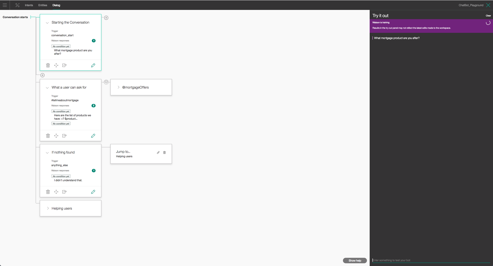

# BANK ChatBot

This Node.js app demonstrates the Conversation service in a simple chat interface simulating a banking model.



## Intents
**#tellmeaboutmortgage**
```
Give me list of mortgage types  
I want to know how to avail the government first time buyer support scheme  
I want to know more about car finance  
I want to know more about First time buyer offers  
I want to know more on home insurance  
I want to know the different home mortgage interest rates  
Tell me about home mortgage for first time buyer  
Tell me about home mortgage latest offers  
Tell me about new mortgage offers  
Tell me how join applications works  
What do you know about Mortgage approvals
```

**#help**
```
help  
How it works  
I need assistance  
I need help  
I need support  
This is not working  
what can I do here  
```

**#greetings**
```
hello  
hi  
hii  
howdy  
how ya  
what's up  
you there   
```

## Entities
**@mortgageOffers**
```
mortgageOffers,Home Movers Mortgage
mortgageOffers,First Time Buyers, FTB, first time buyer
mortgageOffers,Switching Mortgage Provider
mortgageOffers,Buy-to-Let Mortgages, buy to let, buy to let mortgage, buytolet
mortgageOffers,SmartMove App
mortgageOffers,Top–Up Mortgage, top up mortgage, topup mortgage
mortgageOffers,Negative Equity Mover
mortgageOffers,Tracker Mortgage Redress Statement
mortgageOffers,Tracker Interest Rate Mortgage
mortgageOffers,As a thank you for taking a new mortgage...
```

Next, create the dialogs...


## Troubleshooting

If you encounter a problem, you can check the logs for more information. To see the logs, run the `cf logs` command:

```none
cf logs <application-name> --recent
```

## License

This sample code is licensed under Apache 2.0.
Full license text is available in [LICENSE](LICENSE).

## Contributing

See [CONTRIBUTING](CONTRIBUTING.md).

## Open Source @ IBM

Find more open source projects on the
[IBM Github Page](http://ibm.github.io/).


[cf_docs]: (https://www.ibm.com/watson/developercloud/doc/common/getting-started-cf.html)
[cloud_foundry]: https://github.com/cloudfoundry/cli#downloads
[demo_url]: http://conversation-simple.mybluemix.net/
[doc_intents]: (http://www.ibm.com/watson/developercloud/doc/conversation/intent_ovw.shtml)
[docs]: http://www.ibm.com/watson/developercloud/doc/conversation/overview.shtml
[docs_landing]: (http://www.ibm.com/watson/developercloud/doc/conversation/index.shtml)
[node_link]: (http://nodejs.org/)
[npm_link]: (https://www.npmjs.com/)
[sign_up]: bluemix.net/registration
